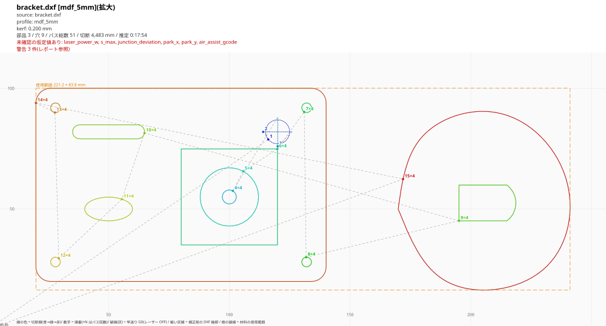

# laser-dxf2gcode

Fusion 360 で描いた DXF を、ダイオードレーザー **Creality Falcon2(GRBL 系)** 用の G-code に変換する CLI ツールです。
**カーフ補正** と **内側→外側の切断順序** を自動で行い、生成物は必ず **SVG プレビューと加工レポート** を添えて出します。

> [!WARNING]
> **必ず端材でテストしてから本番材を切ること。**
> このツールの出力は実際にレーザーを発振させ、可燃物(MDF など)を切断します。
> 生成された SVG プレビューを目視で確認してから流してください。加工中はその場を離れないでください。

---

## 目次

1. [何をするツールか / なぜ作ったか](#何をするツールか--なぜ作ったか)
2. [インストール](#インストール)
3. [使い方](#使い方)
4. [最初にやること: キャリブレーション](#最初にやること-キャリブレーション)
5. [安全上の注意](#安全上の注意)
6. [設計の要点](#設計の要点)
7. [設定ファイル](#設定ファイル)
8. [構成とテスト](#構成とテスト)
9. [制限事項](#制限事項)

---

## 何をするツールか / なぜ作ったか

```
part.dxf ──▶ 読み込み ──▶ 入れ子判定 ──▶ カーフ補正 ──▶ 切断順序 ──▶ G-code ──▶ 安全検証 ──▶ part.gcode
 (Fusion 360)  直線近似      外形/穴       ±kerf/2        内→外       M4/S/F      読み直して     part_preview.svg
               端点連結                                  貪欲法                   規則チェック   part_report.txt
```

LightBurn の代替を目指したものではありません。**「Fusion 360 で設計した板材部品を、寸法どおりに、安全に切り出す」**
という 1 つの用途に絞っています。

汎用のレーザーソフトでも切断はできますが、次の点を毎回手作業で気にする必要がありました。

- **寸法が合わない**: レーザーの切り幅(カーフ)の分だけ部品は小さく、穴は大きくなります。
  Ø4.2 のつもりのボルト穴が Ø4.4 に、20mm の嵌合が 19.8mm になります。
- **順番を間違えると失敗する**: 外形を先に切ると部品が落ちたりずれたりして、あとから切る穴の位置が狂います。
- **範囲外に気付かない**: Fusion 360 のスケッチ原点が部品中心にあると、座標が負になります。

このツールはこれらを **設計段階の寸法を正として** 自動で処理し、処理結果を人間が必ず確認できる形(SVG)で出します。

## インストール

Python 3.10 以上が必要です(開発は 3.12 / Windows 11 で確認)。

```bash
python -m venv .venv
```

```bash
.venv/Scripts/python -m pip install -r requirements.txt
```

(macOS / Linux では `.venv/bin/python`)

依存ライブラリ: `ezdxf`(DXF 読み込み)、`pyclipper`(オフセット)、`PyYAML`(設定)、`pytest`(テスト)。
SVG は外部ライブラリを使わず自前で書き出しています。

## 使い方

### 変換

```bash
python dxf2gcode.py convert part.dxf -p mdf_5mm
```

Fusion 360 は **スケッチ 1 つにつき DXF 1 ファイル** を書き出すので、外形と穴が別ファイルになります。
その場合は並べて渡してください。まとめて読み込むので、入れ子判定も切断順序もファイルの区別なく働きます。

```bash
python dxf2gcode.py convert 外形.dxf 穴1.dxf 穴2.dxf -p mdf_5mm --align lower-left
```

`out/` に 4 つのファイルができます。

| ファイル | 内容 |
|---|---|
| `part.gcode` | 本体。**これを流すのは SVG を確認してから** |
| `part_preview.svg` | 加工エリア全体(400×415)の中での位置確認用 |
| `part_detail.svg` | 使用範囲を拡大した切断順の確認用 |
| `part_report.txt` | 加工レポート(コンソールにも表示) |

主なオプション:

| オプション | 意味 |
|---|---|
| `-p mdf_5mm` | 材料プロファイル(`profiles/mdf_5mm.yaml`) |
| `-o out/x.gcode` | 出力先 |
| `--kerf 0.18` | カーフ幅を一時的に上書き |
| `--align lower-left --margin 5` | 図形の左下を (5, 5) に移動(Fusion の原点が部品中心のとき) |
| `--offset DX DY` | 全体を平行移動 |
| `--lead-in 1.5` | 外形の切り始めに 1.5mm の進入線を付ける(既定なし) |
| `--pass-mode cycle` | 全体を 1 周ずつ繰り返す(既定 `path` = 輪郭ごとに回数分続けて切る) |
| `--frame` | 使用範囲の外周を **レーザー OFF** でなぞる G-code も出す(材料の置き位置確認用) |
| `--engrave marks.dxf` | 刻印用の DXF を重ねる(複数指定可)。中身をすべて刻印の層として、切断より先に加工 |
| `--as-layer engrave` | 入力 DXF のレイヤー名を無視し、ファイル全体をその層として加工 |
| `--cooldown 3` | 発振のたびにレーザー OFF で 3 秒待つ(熱がこもって炎が出るのを防ぐ。切断レベルの出力の後だけ) |
| `--mark-only` | 切らずに、切る線を浅く刻印するだけにする(手で切るときの案内線。`docs/MANUAL_CUT.md`) |
| `--min-gap 0.5` | 切断線どうしがこの距離より近ければ警告(細い削り残し対策。既定 0.5mm) |
| `--assume-mm` | DXF に単位が入っていないとき、数値が mm であると確認した上で続行 |
| `--no-return-home` | 最後に原点へ戻らない |

### プレビューの見方



- 線の色 = 切断の順番(**青 → 緑 → 赤**)。穴が青寄り、外形が赤寄りになっていれば「内→外」
- 数字 = 開始点と順番。`3×4` は「3 番目の輪郭を 4 パス」
- 灰色の破線 = 早送り(G0、レーザー OFF)
- 細い灰色の線 = 補正前の DXF 輪郭(色の線との差がカーフ補正)
- 橙の破線 = 材料の使用範囲

プレビューは **生成済みの G-code を読み直して** 描いています(後述)。

### 加工レポートの例

```
部品数(外形)  : 3
穴の数        : 9
輪郭の数      : 15
パス総数      : 51(輪郭 × パス回数 = 発振 M4〜M5 の回数)
切断距離 合計 : 4,513.7 mm(パス回数込み)
移動距離 合計 : 964.4 mm(G0 早送り)
推定所要時間  : 0:18:02(切断 0:17:52 + 移動 0:00:09)
材料の使用範囲: X 20.10 〜 240.91, Y 16.53 〜 99.90  (220.81 × 83.37 mm)
```

### 組み木の箱を作る(ごみ箱・小物入れ)

上面が開いた箱を、寸法と板厚だけで生成します。5 枚の板(前・後・左・右・底)の辺が
指のように互い違いに噛み合う「組み木(フィンガージョイント)」で、木工用ボンドで接着して組みます。

```bash
python dxf2gcode.py box --size 100 100 74 --thickness 2.5 -p mdf_2_5mm --label ATN
```

- `--size W D H` は **外寸**。`--thickness` は **ノギスで測った実際の板厚**(表示とずれると指の深さが合わない)
- 材料が小さいときは `--sheet 200 300` のように大きさを渡すと、入りきらない板を 2 枚目以降に分けて出力します
- `--label` の文字は前の板の中央に刻印されます(英大文字・数字・`.-/`)
- `--pass-mode cycle --cooldown 3` を付けると、全部の板を 1 周ずつ順に回り、発振のたびに 3 秒冷まします(MDF で炎が出やすいとき)
- `--joint butt --mark-only` で、組み木なしの長方形 5 枚を**刻印だけ**するデータになります(手で切る用)
- 使用範囲の外周をレーザー OFF でなぞる `*_frame.gcode` も一緒に出ます
- 寸法はカーフ補正後の仕上がり寸法です。**カーフを実測してから** 切ると、指がぴったり嵌まります

角や辺では 2〜3 枚の板が同じ場所を取り合うので、「どの板の指が受け持つか」を規則で決めています
(`src/boxgen.py` の冒頭)。テストでは 5 枚を 3D に組んで、辺と角のどの点もちょうど 1 枚だけが
占めること(隙間も重なりもないこと)と、体積が箱の殻と一致することを確かめています。

### 刻印と切断を分ける

切断用と刻印用を別々のスケッチとして、**同じ原点のまま** DXF に書き出し、次のように渡します。

```bash
python dxf2gcode.py convert 外形.dxf --engrave 刻印.dxf -p mdf_5mm
```

- 刻印用ファイルの中身は、レイヤー名に関係なくすべて `engrave` の設定(既定 30% / 3000mm/min / 貫通しない)で加工します
- 位置合わせ(`--align` / `--offset`)は全ファイルまとめて行うので、刻印と外形の相対位置は崩れません
- 刻印は、部品が 1 つも切り離されていない最初のうちに済ませます
- 別の層を使いたいときは `--engrave-layer score` のように指定します
- ファイル全体を刻印にしたいだけなら `--as-layer engrave` でも同じことができます

### 加工エリア外のとき

1 点でも範囲外があれば **G-code を 1 行も出さずに** 終了コード 2 で止まります。

```
[中止] 加工エリア (0<=X<=400.0, 0<=Y<=415.0) の外の座標が 164 点あります。G-code は出力しません。
  X=-7.134 Y=-7.148  ← path #1 layer='0' role=hole CIRCLE(handle=34)
  ...
  範囲外の点の広がり: X -39.900〜39.900, Y -24.900〜24.900
  対処: DXF の原点を見直すか、--align lower-left / --offset DX DY で配置してください
```

同じ名前の古い G-code が残っていると、それを誤って流す危険があります。
失敗したときは既存の `part.gcode` を `part.gcode.stale` に改名して退避します。

### Fusion 360 側の準備

- スケッチを右クリック →「DXF 形式で保存」。単位は **mm** のドキュメントで
- Fusion 360 のスケッチから書き出した DXF は、たいてい全部がレイヤー「0」に入ります。そのままだと全部が切断になるので、
  刻印したい線は **別のスケッチとして書き出し**、`--engrave` で重ねてください(下記)
- 他の CAD でレイヤー名を付けられる場合は、刻印したい線のレイヤー名を `engrave` にすれば `--engrave` は不要です
  (レイヤー名がプロファイルに無いものは `default_layer` = `cut` で切断)
- 裏返しの面に描いたスケッチは DXF 内で押し出し方向が -Z になりますが、OCS を解釈して正しく変換します
- **切り欠きに注意**: Fusion で「外形を削るための四角形」を別スケッチに描いている場合、DXF では
  独立した閉じた輪郭なので **切り欠きではなく穴として切られます**。外形の線と重なっていると細い削り残しが
  でき、焦げて落ちます。`--min-gap`(既定 0.5mm)がこの状態を警告します。外形は「切りたい最終形状そのもの」を
  1 本の閉じた輪郭として描いてください

---

## 最初にやること: キャリブレーション

プロファイルの値(カーフ 0.20mm、100% / 250mm/min / 4 パス)はすべて **仮定値** です。
実際の値は機体・材料のロット・レンズの汚れで変わるので、最初に必ず実測してください。

### 手順 1: 切断条件を決める(テストピース)

```bash
python dxf2gcode.py calibrate coupon -p mdf_5mm
```

20mm 角のピースを 4 つ並べて、それぞれ違う条件で切ります。各ピースには記号と設定値が刻印されます
(`A` / `P100` = 出力 100% / `F250` = 250mm/min / `N4` = 4 パス)。対応表はコンソールとレポートにも出ます。

| 記号 | 既定の条件(プロファイルの cut を基準) |
|---|---|
| A | 基準(100% / 250 / 4) |
| B | 速度 ×1.25 |
| C | パス回数 −1 |
| D | 出力 ×0.8 |

既定の 4 条件は **基準と同じか弱い側** だけです(いきなり強い条件は試さない)。
A でも切れなければ、条件を指定してやり直します:

```bash
python dxf2gcode.py calibrate coupon -p mdf_5mm --variants 100:200:4,100:250:5,100:200:5,100:150:4
```

**切り抜けた中で最もエネルギーが少ない条件**(速い・回数が少ない)を選び、書き戻します:

```bash
python dxf2gcode.py calibrate apply-cut -p mdf_5mm --layer cut --feed 312 --passes 4 --note "coupon B"
```

### 手順 2: カーフを測る(細片)

```bash
python dxf2gcode.py calibrate kerf -p mdf_5mm --count 3
```

長さ 50mm × 幅 10mm の細片を **カーフ補正なし** で切ります。
既定の位置(Y=40〜)はテストピース(Y=10〜30)と重ならないので、同じ端材に続けて切れます。レーザーは線の中心を走るので、
細片の両側の長辺(50mm の直線 2 本)でそれぞれ カーフ/2 ずつ削られます。

```
          設計の線(ビームの中心)
   ─────────────────────────────  ← ビーム幅 k
   ┌───────────────────────────┐  ┐
   │      切り出された細片       │  │ 実測幅 w = 10 − k
   └───────────────────────────┘  ┘
   ─────────────────────────────
```

1. 細片の幅 **w** をノギスで 3 か所以上測り、平均を取る(3 本切ったなら 3 本とも)
2. カーフ **k = 10 − w**(例: w = 9.82mm → k = 0.18mm)
3. 長さ方向も確認: 長さ ≈ 50 − k になっているはず
4. 焦げ(炭化層)は軽く落としてから測る。ノギスで押しつぶさない

書き戻し:

```bash
python dxf2gcode.py calibrate apply-kerf -p mdf_5mm --strip-width 9.82
```

テストピース(補正 0.20mm で切った 20mm 角)の実測寸法 S からも逆算できます:
k = 20 + 0.20 − S。

```bash
python dxf2gcode.py calibrate apply-kerf -p mdf_5mm --square 20.04 --coupon-kerf 0.20
```

### うまく切れないとき: 条件の一覧試験(ラダー)

テストピースが抜けない、FIRE(火焔検知)で止まる、というときは、速度 × 周回の組み合わせを
短い線で一度に試して、**どこから貫通するか**を調べます。

```bash
python dxf2gcode.py calibrate ladder -p mdf_2_5mm --speeds 1500,1000,700,500,350 --passes 1,2,4 --cooldown 1
```

- 15mm の線を格子状に焼きます。終わったら板を光にかざし、光が漏れる線を探します
- 既定で「全部の線を 1 周ずつ順に回る」ので、1 本の線に熱が集中しません
- レポートに、各マスのエネルギー指標と「シナ材なら切れる厚さ」の目安が出ます
  (Creality 公式の 22W 切断条件から求めた換算。MDF がシナの何倍切りにくいかが分かる)

原因の切り分けと対策の一覧は [docs/TROUBLESHOOTING.md](docs/TROUBLESHOOTING.md)、
レーザーで切れない板を手で切る方法は [docs/MANUAL_CUT.md](docs/MANUAL_CUT.md) にあります。

### 手順 3: プロファイルが更新されたことを確認

書き戻しはコメントを残したまま該当行だけを書き換え、`【実測値】日付 根拠` を記録します。

```yaml
mdf_5mm:
  kerf: 0.180                # 【実測値】2026-09-11 細片幅 9.82mm(設計 10mm)から逆算
```

`--dry-run` を付けると、ファイルを変更せずに結果だけ表示します。
最後に Ø4.2 の穴を含む小さな部品を 1 つ切り、実際にボルトが通るかを確かめてから本番に進んでください。

---

## 安全上の注意

- **必ず端材でテストしてから本番材を切る。** 設定・DXF・プロファイルを変えたら、そのたびに。
- **SVG プレビューを目視確認してから流す。** 位置・形・切断順(穴が先、外形が後)・範囲。
- **換気**: MDF の切断煙には接着剤(ホルムアルデヒド系樹脂)の分解物が含まれます。屋外排気かフィルターを必ず使う。
- **火焔警報を有効にする**: `$154=1`(火焔)。あわせて `$153=1`(気流低下)、`$155=1`(レンズ汚れ)も推奨。
  LaserGRBL / LightBurn のコンソールで `$$` を送ると現在値が確認できます。
- **その場を離れない。** MDF は低速・多パスで発火しやすい材料です。消火手段(消火器・濡れタオル)を手の届く所に。
- **エアアシストを使う**: 炎を吹き消し、焦げとレンズの汚れを減らします(`$150/$151` とノブで風量を設定)。
- **レーザーモード `$32=1` を確認**: 0 だと M4 のダイナミックパワーが効かず、角や減速部で焼けすぎます。
- 保護メガネ(波長に合ったもの)を着用する。

このツール側では、次を設計で保証しています。

| 保証すること | 仕組み |
|---|---|
| 加工エリア外の座標を含む G-code を出さない | 生成前に全座標(リードイン・待機位置を含む)を検査し、生成後にもテキストを読み直して再検査 |
| 冒頭で安全な状態にする | `G21 G90 G94` → `M5` → `S0` → `G0 X0 Y0 S0` |
| 早送り中に発振しない | すべての G0 に `S0` を明記し、発振中(M4 のまま)の G0 を検証で禁止 |
| 最後に必ず消灯 | 各輪郭の後に `M5`、ファイル最後の命令も必ず `M5` |
| 冷却待ちの間に焼かない | 待ち(G4)はレーザー OFF のときだけ許可。発振中の G4 は検証で拒否 |
| 一定出力モードを使わない | `M3` は検証で禁止(止まった瞬間も全出力で焼くため)。`M4` のみ |
| 失敗時に古いファイルを流させない | 失敗時は同名の既存 G-code を `.stale` に改名 |
| 未確認の仮定値を忘れさせない | `machine.yaml` の `unverified` が残っている間、毎回警告し G-code のコメントにも記録 |

---

## 設計の要点

### 1. 入れ子判定: 何が外形で、何が穴か

DXF には「これは穴」という情報はありません。閉じた輪郭が平面上に並んでいるだけです。
そこで、各輪郭が **他のいくつの輪郭の内側にあるか**(入れ子の階層)を数えます。

```
┌──────────────────────────── 板 ───────────┐   階層 0 = 外形(部品)
│   ○ ボルト穴                                │   階層 1 = 穴
│        ┌───── 窓 ──────┐                    │   階層 1 = 穴
│        │   ╭─ 島 ─╮    │                    │   階層 2 = 外形(窓の中の別部品)
│        │   │  ○   │    │                    │   階層 3 = 穴(島部品の穴)
│        │   ╰──────╯    │                    │
│        └───────────────┘                    │
└─────────────────────────────────────────────┘
```

**偶数階層は外形、奇数階層は穴** です。窓の中に置いた小部品(階層 2)も、その穴(階層 3)も、この規則だけで正しく分類できます。
「内側にあるか」は輪郭上の点の点内判定(偶奇規則)で調べます。穴の頂点が外形の辺にちょうど乗っている場合に誤判定しないよう、
境界上の点は除外して複数点の多数決を取っています。

### 2. カーフ補正: ビームの中心を「捨て側」へ k/2 ずらす

レーザーは幅 k(カーフ)の溝を掘ります。DXF の線の上をビームの中心がそのまま走ると、
線の **両側** が k/2 ずつ削れます。

```
               部品側 │ 捨て側
                      │
   補正なし       ▓▓▓▓│▓▓▓▓      ← 溝(幅 k)の中心が設計線 → 部品側も k/2 削れる
   補正あり           │▓▓▓▓▓▓▓▓  ← 中心を捨て側へ k/2 → 溝の縁が設計線にぴったり
                      │
                   設計線
```

補正しないと、**部品は各辺 k/2 小さく、穴は各辺 k/2 大きく** なります
(k = 0.2 なら、20mm 角の部品が 19.8mm に、Ø4.2 のボルト穴が Ø4.4 に)。
ほぞや嵌合はガタガタになります。

補正の規則はひとつだけです: **ビームの中心を常に捨て材の側へ k/2 ずらす**。

| 輪郭 | 捨て材の側 | パスのオフセット | 例(k = 0.2) | 仕上がり |
|---|---|---|---|---|
| 外形(偶数階層) | 輪郭の外側 | 外側へ +k/2 | R10 の円盤 → パス R10.1 | 10.1 − 0.1 = **R10.0** |
| 穴(奇数階層) | 穴の内側 | 内側へ −k/2 | R10 の穴 → パス R9.9 | 9.9 + 0.1 = **R10.0** |

テスト(`tests/test_toolpath.py`)では、パスの半径だけでなく「パス ± k/2 = 設計寸法」になることまで確かめています。

> [!IMPORTANT]
> **開発時の指示書との相違(要確認)**
> 指示書では「外形は内側へ、穴は外側へ k/2 オフセット(穴 R10 → R10.1)」とされていましたが、
> これは向きが逆です。穴のパスを R10.1 にすると溝の縁は R10.2 になり、補正なし(R10.1)より
> 誤差が倍になります。指示書の目的(「Ø4.2 の穴にボルトが入るように」)を優先し、上の向きで実装しました。
> 実物での確認方法: キャリブレーション手順 1 のテストピースは補正込みで **20.0mm 角** に仕上がるはずです
> (向きが逆なら 20 − 2k になる)。向きの切り替えは `src/toolpath.py` の `delta = ...` の 1 行です。

**角の扱い**: オフセットには pyclipper(Clipper ライブラリ)を使い、角は丸め(JT_ROUND)で処理します。
外形の出っ張った角では、パスが角を中心とする半径 k/2 の円弧で回り込みます。ビームは円なので、
こうするとビームの縁がちょうど角に接し、**部品の角は尖ったまま** 残ります(テストで確認)。
逆に穴の入り隅は、円いビームでは原理的に尖らせられず、半径 k/2 の丸みが残ります。

**消える形状**: カーフより細い穴やスリットは、内側へのオフセットで消えてしまいます。
その場合は黙って捨てずにエラーにします(切れない形状を切ったつもりにさせない)。

**原点に接した部品**: 外形は外側へ k/2 広がるので、X=0 や Y=0 にぴったり接して描いた部品は
パスが −0.1mm になり、加工エリア検査で停止します。`--align lower-left --margin 5` で余白を取ってください。

### 3. 切断順序: なぜ「内側 → 外側」でなければならないか

外形を先に切ると、部品は母材から切り離されます。すると:

- 部品がハニカムベッドに落ちる/傾く → あとから切る穴が正しい位置に来ない
- 小さい部品はエアアシストで吹き飛ぶ
- 切り離された部品の上で穴を切ると、焦点距離も狂う

だから **部品の穴を全部切ってから、その部品の外形を切る** 必要があります。
入れ子の階層を使うと、これは「**階層の深いものから順に切る**」という単純な規則になります。
穴(奇数階層)は必ずその外形より 1 つ深いので、自動的に外形より先に来ます。窓の中の小部品(階層 2)は、
窓(階層 1)より先に切られます。窓を先に切ると、小部品ごと窓の中身が落ちてしまうからです。

同じ階層の中では「直前の終点に最も近い輪郭」を次に選ぶ貪欲法で移動距離を減らします。
閉じた輪郭は、切り始めの点も最も近い頂点に回転させます。最適解ではありませんが、部品数十個の規模なら十分です。

加えて、次の順序も固定しています。

1. 貫通しない層(刻印など) … 部品が 1 つも切り離されていない、材料が最も安定した状態で
2. 貫通切断の開いたパス(スリットなど)
3. 貫通切断の閉じた輪郭(深い階層から)

複数パスは既定で「1 つの輪郭を指定回数続けて切ってから次へ」(`--pass-mode path`)。
「全体を 1 周ずつ繰り返す」(`cycle`)は材料が冷える時間を取れますが、途中の周回で外形が抜けると、
残りの周回の穴が落ちた部品の上を切ることになるため、既定にはしていません。

### 4. 向きをそろえると、リードインが簡単になる

補正後の輪郭は **外形 = 反時計回り、穴 = 時計回り** にそろえます。すると外形でも穴でも
**進行方向の右側が常に捨て材** になります。リードイン(切り始めの進入線)は切り始めに焦げ跡(ピアス跡)が
残るのを部品の外に逃がすためのものなので、「右側に L だけ離れた点から入る」とだけ書けば済みます。
その点が他の輪郭に近すぎたり、別の部品の中に入ったりする場合は、別の候補点を試し、どこにも置けなければ省略して警告します。

### 5. 「見た絵」と「流すコード」を一致させる

SVG プレビューは、ツールパスの内部データからではなく、**生成済みの G-code テキストを独立したパーサで読み直して** 描いています。
同じパーサで次の規則も検証します。

- 先頭が `G21 G90 G94`、移動や発振の前に `M5`、最後の命令が `M5`
- すべての `G0` に `S0`、M4 のまま `G0` しない
- 許可した命令(`G0 G1 G4 G21 G90 G94 M4 M5 M8 M9 S F X Y P`)以外は拒否(`M3`、`G91`、`G2/G3` など)
- `G4`(待ち)は `G4 P<秒>` の形で、レーザー OFF のときだけ、120 秒以内
- S 値が `$30` 以下、全座標が加工エリア内

G-code 生成部にバグがあれば、プレビューにそのまま現れるか、検証で止まります。
「内部データでは正しいのに、出力されたコードは違う」という事故を構造的に防ぐための二重化です。

### 6. 所要時間の推定

GRBL の先読みプランナを簡略化して再現しています。各ブロックの速度上限を「指令速度」と「軸ごとの最大速度 `$110/$111`」から、
角での速度をジャンクション偏差の式 v² = a·δ·sin(θ/2) / (1 − sin(θ/2)) から求め、
前向き・後ろ向きの 2 回の走査で加減速(`$120/$121`)が間に合う速度に抑えてから、台形速度で時間を積算します。
パス回数は G-code に展開済みなので自然に加味されます。

### 7. DXF 読み込みの細部

- 曲線(円・円弧・楕円・スプライン・ポリラインのふくらみ)は **弦の許容誤差(サジッタ)0.05mm** で直線近似
- 端点が 0.01mm 以内の線を連結して閉ループにする(同じレイヤー内のみ)。3 本以上が 1 点に集まる分岐は警告
- `$INSUNITS` が mm(4)でなければ停止。単位なし(0)も停止(`--assume-mm` で明示的に続行)
- CIRCLE / ARC / LWPOLYLINE の **OCS(押し出し方向)** を解釈する。-Z の図形を無視すると左右反転する
- 同じ位置に重なった輪郭(二重線)は 1 本にまとめる。二度切りは焦げ・発火の原因
- INSERT(ブロック参照)は展開する

---

## 設定ファイル

### `machine.yaml`(機械)

| キー | 値 | 実測/仮定 |
|---|---|---|
| `x_max` / `y_max` | 400 / 415 | 実測(`$130/$131`) |
| `max_rate_x` / `max_rate_y` | 25000 / 8000 | 実測(`$110/$111`) |
| `accel_x` / `accel_y` | 1000 / 1000 | 実測(`$120/$121`) |
| `s_max` | 1000 | 実測(`$30`) |
| `laser_power_w` | 22 | **仮定**(22W / 40W 要確認) |
| `junction_deviation` | 0.01 | 実測(`$11`) |
| `park_x` / `park_y` | 0 / 0 | **仮定** |
| `air_assist_gcode` | false | **仮定**(M8/M9 で制御できるか要確認) |

未確認の項目は `unverified:` に列挙してあり、残っている間は毎回警告が出ます。
確認手順は [docs/TASK0_CHECKLIST.md](docs/TASK0_CHECKLIST.md) を参照してください。

### `profiles/<材料>.yaml`(材料)

```yaml
mdf_5mm:
  kerf: 0.20                 # 【仮定値】
  default_layer: cut         # DXF のレイヤー名が一致しないときに使う層
  layers:
    cut:
      power: 100             # [%] s_max を 100% として S 値に換算(0〜s_max にクランプ)
      feed: 250              # [mm/min]
      passes: 4
      through_cut: true      # 貫通切断: カーフ補正と内→外の順序の対象
      kerf_compensation: true
      order: 10
      air_assist: true
      per_pass:              # 任意: パスごとの上書き(1 パス目だけ弱く、など)
        - {power: 60}
    engrave:
      power: 30
      feed: 3000
      passes: 1
      through_cut: false
      kerf_compensation: false
      order: 0
```

別の材料は `profiles/` に YAML を追加し `-p <名前>` で選びます。

同梱のプロファイル(値はすべて仮定値。買った板でキャリブレーションしてから使う):

| 名前 | 板 | 切断の目安 | 備考 |
|---|---|---|---|
| `mdf_2_5mm` | MDF 2.5mm | 100% / 500mm/min / 2 パス | 薄板。焦げやすいので刻印は弱め |
| `mdf_5mm` | MDF 5mm | 100% / 250mm/min / 4 パス | 開発時の基準 |
| `mdf_6mm` | MDF 6mm | 100% / 200mm/min / 6 パス | ダイオードには厚い部類。発火に特に注意 |

---

## 構成とテスト

```
dxf2gcode.py          エントリポイント
machine.yaml          機械設定
profiles/mdf_5mm.yaml 材料プロファイル
src/
  dxf_reader.py       DXF 読み込み・直線近似・端点連結・単位確認
  toolpath.py         入れ子判定・カーフ補正・切断順序・リードイン
  gcode.py            G-code 生成・加工エリア検査・生成後の安全検証(パーサ)
  preview.py          SVG プレビュー・加工レポート・所要時間推定
  calibrate.py        テストピース / カーフ細片 / 測定値の書き戻し
  boxgen.py           組み木の箱の板の形と材料への配置
docs/
  TROUBLESHOOTING.md  切れない・FIRE で止まるときの原因と対策、検証の順番
  MANUAL_CUT.md       線だけ刻印して手で切る方法
  TASK0_CHECKLIST.md  機械設定の確認項目と結果
  pipeline.py         上記をつなぐ処理とファイル出力
  config.py           設定の読み込みと検証
  cli.py              コマンドライン
samples/make_samples.py  入れ子構造を含むサンプル DXF の生成
tests/                pytest
```

```bash
.venv/Scripts/python -m pytest
```

安全に関わる項目(切断順序・エリア検査・G-code の規則)は重点的にテストしています。

| テスト | 内容 |
|---|---|
| `test_toolpath.py` | 同心円 4 重の階層、R10 の穴 → パス R9.9(仕上がり R10.0)、R10 の外形 → パス R10.1(仕上がり R10.0)、部品の角が尖ったまま残る、穴が必ず外形より先(開始位置を変えても)、島部品、貪欲法、リードイン |
| `test_gcode.py` | 範囲外(負・1mm 超・完全に外・カーフ補正で外へ出る)で例外、全 G0 に S0 かつ消灯中、末尾 M5、M4→G1→M5 の構造、S 値の換算とクランプ、パスごとの設定、検証器が不正な G-code を拒否すること |
| `test_dxf_reader.py` | 端点連結、開いたパス、単位、OCS、ふくらみ、楕円・スプライン、重複除去、ブロック |
| `test_preview.py` | 所要時間(直線の解析解との一致、角の減速、Y 軸の速度制限)、SVG の構造 |
| `test_calibrate.py` | YAML の書き戻しでコメントが消えない、カーフの逆算、刻印がピースに収まる |
| `test_cli.py` | 通しの変換、範囲外で G-code を出さない、古い G-code の退避、単位違いの拒否 |

サンプルでの通し確認:

```bash
python samples/make_samples.py
```

```bash
python dxf2gcode.py convert samples/bracket.dxf -p mdf_5mm --frame
```

## 制限事項

- G2/G3(円弧補間)は出さず、すべて直線近似(G1)で出力します
- ラスター彫刻(画像の塗りつぶし)には対応しません。刻印はベクター(線をなぞる)のみ
- 貪欲法の順序は最適ではありません
- 所要時間は概算です(M4/M5 の切り替えや送信ソフトの通信待ちは含みません)
- `pass_mode: cycle` では、途中の周回で外形が抜けると以降の穴の位置がずれる可能性があります
- 外形は外側へ k/2 広がるので、加工エリアの端(X=0, Y=0 など)に接して描いた部品はエリア外として停止します
- 穴の入り隅には半径 k/2 の丸みが残ります(円いビームの原理的な制約)
